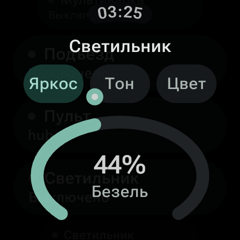
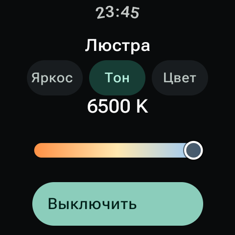
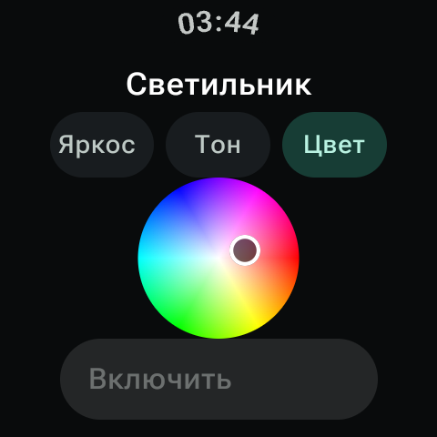

<p align="center">
  
</p>

<h1 align="center">Dynorixz Smart Home</h1>

<p align="center">
  Минималистичный клиент «Дома с Алисой» для Wear OS — устройства, свет, группы и сценарии прямо на запястье.
</p>

<p align="center">
  <a href="https://github.com/Dynorixz/dynorixz-smart-home-wear-os/releases/latest"></a>
  
  
  
</p>

Dynorixz Smart Home получает реальный дом пользователя через публичный API Яндекса и строит интерфейс по фактически объявленным устройством `capabilities` и `properties`. В production-коде нет демонстрационных устройств, подмены ответов или private API.

> Это независимый клиент с опубликованным исходным кодом, не официальный продукт Яндекса. Названия Яндекс, Алиса и «Дом с Алисой» принадлежат их правообладателям.

## Интерфейс

<table>
  <tr>
    <td align="center"></td>
    <td align="center"></td>
    <td align="center"></td>
  </tr>
  <tr>
    <td align="center"><sub>Крупный индикатор яркости</sub></td>
    <td align="center"><sub>Температура света</sub></td>
    <td align="center"><sub>Полноцветная палитра</sub></td>
  </tr>
</table>

## Быстрый старт

1. Скачайте два APK из [последнего релиза](https://github.com/Dynorixz/dynorixz-smart-home-wear-os/releases/latest): Phone устанавливается на сопряжённый Android-телефон, Wear — на часы.
2. Запустите приложение на часах и нажмите «Войти».
3. Продолжите вход на телефоне либо выберите вход непосредственно на часах и разрешите приложению доступ к умному дому.
4. После возврата в приложение устройства загрузятся автоматически. При желании добавьте плитки «Умный дом» и «Свет» через системный редактор Wear OS.

**Пользователям готового релиза не нужно создавать OAuth-приложение, вводить Client ID или собирать проект.** Production APK уже настроены: достаточно установить их и войти в Яндекс ID.

Телефонный модуль не имеет launcher-экрана: это небольшой relay, который принимает OAuth callback и безопасно передаёт его сопряжённым часам.

## Что реализовано

- OAuth Authorization Code + PKCE S256 со `state`, без `CLIENT_SECRET` в приложении;
- предпочтительное продолжение входа в браузере телефона через Wear Data Layer и прямой browser flow на часах;
- зашифрованное AES-GCM хранение токена в DataStore, ключ — в Android Keystore;
- загрузка домов, комнат, устройств, групп и сценариев из `GET /v1.0/user/info`;
- обновление конкретного устройства через `GET /v1.0/devices/{id}`;
- реальные команды устройства, группы и сценария;
- универсальный capability engine: `on_off`, `range`, `mode`, `toggle`, `color_setting`;
- RGB/HSV-пресеты, диапазон цветовой температуры и сцены цвета, когда они объявлены устройством;
- read-only float/event properties: температура, влажность, батарея, давление, движение, протечка и любые другие instance из API;
- комнаты, группы, сценарии, поиск и фильтры по состоянию, комнате и типу;
- локальное избранное для устройств, групп и сценариев, включая порядок элементов;
- Wear OS Tile и complications с выбираемыми действиями;
- rotary input для всех числовых диапазонов;
- optimistic UI с последующей сверкой реального состояния;
- Room-кэш, явные offline/stale состояния и lifecycle-aware автообновление;
- типизированные ошибки 401/403/408/429/5xx, device offline и безопасный диагностический logging;
- Material 3 for Wear OS, Dynamic Color, светлая/тёмная/системная темы.

Поддерживается Wear OS 3 и новее (`minSdk 30`). Проект собирается с `compileSdk/targetSdk 37`.

## Структура проекта

```text
wear/       основное Wear OS приложение, Tile и complication provider
mobile/     минимальный телефонный relay для OAuth callback
gradle/     version catalog и Gradle Wrapper
```

Оба APK имеют один `applicationId` — `com.dynorixz.smarthome`. Это разные device-target APK: `wear` устанавливается на часы, `mobile` — на сопряжённый телефон. Для release они обязательно должны быть подписаны одним сертификатом.

## Требования

- часы с Wear OS 3 или новее и доступом в интернет;
- сопряжённый Android-телефон с Google Play Services для удобного входа через телефон.

Для самостоятельной сборки дополнительно нужны Android Studio с поддержкой AGP 9.3.x, JDK 17, Android SDK Platform 37 и собственное OAuth-приложение Яндекса.

## Для разработчиков: собственное OAuth-приложение

> Этот раздел нужен только для самостоятельной сборки, форка или изменения Client ID. Пользователи APK со страницы Releases могут его пропустить.

1. Откройте [Yandex OAuth](https://oauth.yandex.ru/) и создайте приложение **для авторизации пользователей**. Для production заполните название, контакты и сведения, которые увидит пользователь.
2. В доступах выберите только:

   - `iot:view` — просмотр умного дома;
   - `iot:control` — управление устройствами, группами и сценариями.

3. Добавьте точный Redirect URI:

   ```text
   dynorixzsmarthome://oauth/callback
   ```

   Он должен совпадать по scheme, host и path. Callback объявлен и в `wear`, и в `mobile`: на телефоне код передаётся на часы по Wear Data Layer; при входе непосредственно на часах callback принимает Wear-приложение.

4. Для Android-платформы укажите package name `com.dynorixz.smarthome` и SHA-256 fingerprint сертификата debug или release сборки. Если консоль разделяет Android-платформу и Web services, Redirect URI добавляется в список Redirect URI, а package/fingerprint — в Android-платформу.
5. Скопируйте Client ID. Секрет приложения не копируйте: native client использует PKCE, и официальный token exchange допускает `client_id + code_verifier` без `client_secret`.

Официальные источники: [протокол пользовательского Smart Home API](https://yandex.ru/dev/dialogs/smart-home/doc/ru/concepts/platform-protocol), [получение authorization code и PKCE](https://yandex.com/dev/id/doc/en/codes/code-url), [регистрация OAuth-приложения](https://yandex.com/dev/id/doc/en/register-auth).

## Для разработчиков: настройка Client ID

Скопируйте пример локальной конфигурации:

```powershell
Copy-Item local.properties.example local.properties
```

Отредактируйте `local.properties`:

```properties
sdk.dir=C\:\\Users\\you\\AppData\\Local\\Android\\Sdk
YANDEX_CLIENT_ID=YOUR_REAL_CLIENT_ID
```

`local.properties`, keystore-файлы и другие credentials исключены из Git. Client ID сам по себе не является секретом, но хранится в единственной локальной точке настройки. Access token в build configuration не попадает.

## Сборка из исходников

Debug APK:

```powershell
.\gradlew.bat :wear:assembleDebug :mobile:assembleDebug
```

Результаты:

```text
wear/build/outputs/apk/debug/wear-debug.apk
mobile/build/outputs/apk/debug/mobile-debug.apk
```

Release build включает R8 и shrink resources. Для подписанных APK задайте четыре переменные окружения перед запуском Gradle:

```powershell
$env:DYNORIXZ_KEYSTORE_PATH='C:\secure\dynorixz-release.jks'
$env:DYNORIXZ_STORE_PASSWORD='<store-password>'
$env:DYNORIXZ_KEY_ALIAS='<key-alias>'
$env:DYNORIXZ_KEY_PASSWORD='<key-password>'
.\gradlew.bat :wear:assembleRelease :mobile:assembleRelease
```

Без этих переменных Gradle создаст unsigned release APK. Не коммитьте keystore или пароли. Подписывайте оба модуля одним ключом.

На Windows AGP может отказываться работать из каталога с нелатинскими символами. В проекте включён `android.overridePathCheck=true`; если сторонний инструмент всё равно некорректно обрабатывает путь, используйте checkout с ASCII-путём или временно подключите каталог буквой диска.

## Установка

Готовые production APK доступны на странице [Releases](https://github.com/Dynorixz/dynorixz-smart-home-wear-os/releases). Файл `Phone` устанавливается на телефон, `Wear` — на часы. Оба APK подписаны одним сертификатом Dynorixz.

SHA-256 production-сертификата:

```text
FE:3F:1A:B3:AE:59:52:8B:B7:6F:6A:9C:8E:81:00:6E:29:ED:48:E4:B3:C6:CD:54:5E:B1:6B:41:CD:74:4D:CA
```

Если на устройстве уже установлена сборка с другой подписью, Android не сможет обновить её поверх. Удалите старую версию и установите production APK заново; локальные настройки и OAuth-сессия при этом будут очищены.

Включите Developer options и ADB debugging на часах. Подключитесь по Wi-Fi или через Android Studio Pair Devices, затем:

```powershell
adb -s <WATCH_SERIAL> install -r wear\build\outputs\apk\debug\wear-debug.apk
```

Для входа через телефон подключите телефон к ADB и установите relay:

```powershell
adb -s <PHONE_SERIAL> install -r mobile\build\outputs\apk\debug\mobile-debug.apk
```

Если relay не установлен или телефон недоступен, на экране входа выберите «Открыть на часах». Пароль вводится только на официальной странице Яндекс ID.

После установки добавьте Tile «Умный дом» через системный редактор Tiles и complication через редактор циферблата. Список быстрых действий выбирается в настройках приложения; провайдеры обновляются сразу после сохранения выбора.

## Реализованный публичный API

| Назначение | Endpoint | Поведение клиента |
|---|---|---|
| Полный дом | `GET /v1.0/user/info` | Дома, комнаты, устройства, группы, сценарии, capabilities/properties и локальный Room-кэш |
| Состояние устройства | `GET /v1.0/devices/{device_id}` | Сверка после действия и ручное обновление |
| Действия устройств | `POST /v1.0/devices/actions` | Все поддержанные UI-команды формируются из descriptor/state instance/value |
| Состояние группы | `GET /v1.0/groups/{group_id}` | Актуальные capabilities загружаются при открытии группы и после действий |
| Действия группы | `POST /v1.0/groups/{group_id}/actions` | Динамические group capabilities |
| Запуск сценария | `POST /v1.0/scenarios/{scenario_id}/actions` | Реальный запуск с результатом и haptic feedback |

Тела действий соответствуют документации Яндекса: [устройства](https://yandex.ru/dev/dialogs/smart-home/doc/ru/concepts/platform-capabilities), [группы](https://yandex.ru/dev/dialogs/smart-home/doc/ru/concepts/platform-group-capabilities), [сценарии](https://yandex.ru/dev/dialogs/smart-home/doc/ru/concepts/platform-scenario).

Неизвестные будущие capability/property десериализуются в `Unknown`, не приводят к падению и не создают неподтверждённую управляющую кнопку. Любой известный capability работает независимо от названия или бренда устройства: лампы, розетки, климат, пылесосы, ТВ и колонки получают те контролы, которые реально объявляет API.

## Что публичный API не предоставляет

Клиент намеренно не имитирует отсутствующие возможности:

- создание, редактирование и перестановка комнат, устройств, групп и сценариев;
- добавление новых физических устройств и привязка аккаунтов производителей;
- история датчиков, энергопотребления и событий, если устройство отдаёт только текущее значение;
- голосовой ввод Алисы, управление очередью музыки и приватные функции Яндекс Станций;
- видеопотоки камер и домофонов;
- firmware/update, диагностика производителя и настройки, не представленные как public capability;
- удаление устройства из аккаунта, хотя endpoint присутствует в протоколе: это необратимая административная операция и не относится к управлению с часов.

Если устройство не публикует нужную capability/property, приложение сообщает, что доступных элементов управления нет. Private endpoints приложения «Дом с Алисой» не используются.

## Offline, ошибки и синхронизация

- Последний успешный `/user/info` хранится в Room и после перезапуска показывается как устаревший кэш.
- Управляющие действия отключаются без сети; fake success не показывается.
- При изменении значения UI оптимистично обновляется, ждёт подтверждение API и выполняет delayed reconciliation.
- Неуспешное действие откатывается к последнему подтверждённому состоянию.
- 401 очищает зашифрованную сессию и кэш и возвращает пользователя к входу.
- Автообновление работает только пока главный экран находится в lifecycle `STARTED`; интервал задаётся в настройках.
- Логи содержат method, endpoint path, HTTP status, latency и `request_id`, но не headers, Bearer token, OAuth code или тела запросов.

## Безопасность

- OAuth `state` защищает callback от подмены, PKCE S256 связывает code с конкретной попыткой входа.
- Access/refresh token и незавершённая OAuth-сессия сериализуются в один AES-GCM blob в DataStore.
- AES-ключ создаётся и остаётся в Android Keystore.
- HTTP cleartext запрещён manifest-настройкой; API и OAuth используют HTTPS.
- В приложении нет `CLIENT_SECRET`, hardcoded токена и стороннего backend.
- Phone relay передаёт только одноразовый callback URL на сопряжённые часы; `state` и PKCE проверяются уже на часах.

Custom URI scheme может быть заявлен другим приложением Android. Риск перехвата authorization code снижается PKCE, а риск подмены callback — проверкой `state`. Для публикации рекомендуется также зарегистрировать release SHA-256 fingerprint и рассмотреть verified HTTPS App Link, если у проекта появится доверенный домен.

## Тесты и проверки

Unit/API tests:

```powershell
.\gradlew.bat :wear:testDebugUnitTest
```

Compose UI tests на подключённых часах или Wear OS emulator:

```powershell
.\gradlew.bat :wear:connectedDebugAndroidTest
```

Полная локальная проверка:

```powershell
.\gradlew.bat :wear:testDebugUnitTest :wear:lintDebug :wear:assembleDebug :wear:assembleRelease :mobile:assembleDebug :mobile:assembleRelease
```

Тесты покрывают mapping capability/property, генерацию действий, token expiry, error mapping, реальный JSON-контракт MockWebServer, 401/session invalidation, offline action, сценарий и основные Compose-контролы. End-to-end проверка реального аккаунта требует собственного Client ID, consent пользователя и физических часов/эмулятора; credentials в репозитории намеренно отсутствуют.

## Релизы и лицензирование

История заметных изменений находится в [CHANGELOG.md](CHANGELOG.md). Публикуемые APK проверяются `apksigner`; release keystore и его пароль никогда не входят в репозиторий.

Отдельная лицензия на повторное использование кода пока не предоставлена. Публикация исходников на GitHub сама по себе не передаёт дополнительных прав сверх предусмотренных правилами GitHub и применимым законодательством.
